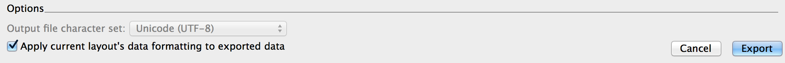

FMPXMLRESULT2JSON
=================

As I see more and more people using AngularJS, I believe some people might benefit from
releasing this stylesheet from 2008, namely: fmpxmlresult2json.xslt

This simple "flat file"-export( only one level of tables, does not exceed the use of
.csv/.tab files ) is excelent for newsfeeds and/or productlist, but falls short of a
full product description.

========================================================================================

```
curl -o data.fmpxmlresult.xml https://github.com/TyrfingMjolnir/FileMaker-Swift/blob/master/fmError.json
curl https://raw.githubusercontent.com/TyrfingMjolnir/FMPXMLRESULT2JSON/master/fmpxmlresult2json.xslt | xsltproc - data.fmpxmlresult.xml
```
Output:
```
[
	{
		"error":"Success",
		"errorCode":"0",
		"description":"Hooray!"
	},
	{
		"error":"Bad request",
		"errorCode":"400",
		"description":"Occurs when the server cannot process the request due to a client error."
	},
	{
		"error":"Unauthorized",
		"errorCode":"401",
		"description":"Occurs when the client is not authorized to access the API. If this error occurs when attempting to log in to a database session, then there is a problem with the specified user account or password. If this error occurs with other calls, the access token is not specified or it is not valid."
	},
	{
		"error":"Forbidden",
		"errorCode":"403",
		"description":"Occurs when the client is authorized, but the call attempts an action that is forbidden for a different reason."
	},
	{
		"error":"Not found",
		"errorCode":"404",
		"description":"Occurs if the call uses a URL with an invalid URL schema. Check the specified URL for syntax errors."
	},
	{
		"error":"Method not allowed",
		"errorCode":"405",
		"description":"Occurs when an incorrect HTTP method is used with a call."
	},
	{
		"error":"Unsupported media type",
		"errorCode":"415",
		"description":"Occurs if the required header is missing or is not correct for the request: For requests that require "Content-Type: application/json" header, occurs if the "Content-Type: application/json" header is not specified or if a different content type was specified instead of the "application/json" type. For requests that require "Content-Type: multipart/form-data" header, occurs if the "Content-Type: multipart/form-data" header is not specified or if a different content type was specified instead of the "multipart/form-data" type."
	},
	{
		"error":"FileMaker Server error",
		"errorCode":"500",
		"description":"Includes FileMaker error messages and error codes. See FileMaker error codes in FileMaker Pro Advanced Help."
	}
]
```



License
=======

Copyright (c) 2008 Gjermund Gusland Thorsen, released under the MIT License.

All rights deserved.

Permission is hereby granted, free of charge, to any person obtaining a copy of this software and associated documentation files (the "Software"), to deal in the Software without restriction, including without limitation the rights to use, copy, modify, merge, publish, distribute, sublicense, and/or sell copies of the Software, and to permit persons to whom the Software is furnished to do so, subject to the following conditions:

The above copyright notice and this permission notice shall be included in all copies or substantial portions of the Software.

This piece of software comes with ABSOLUTELY NO WARRANTY, to the extent permitted by applicable law.
